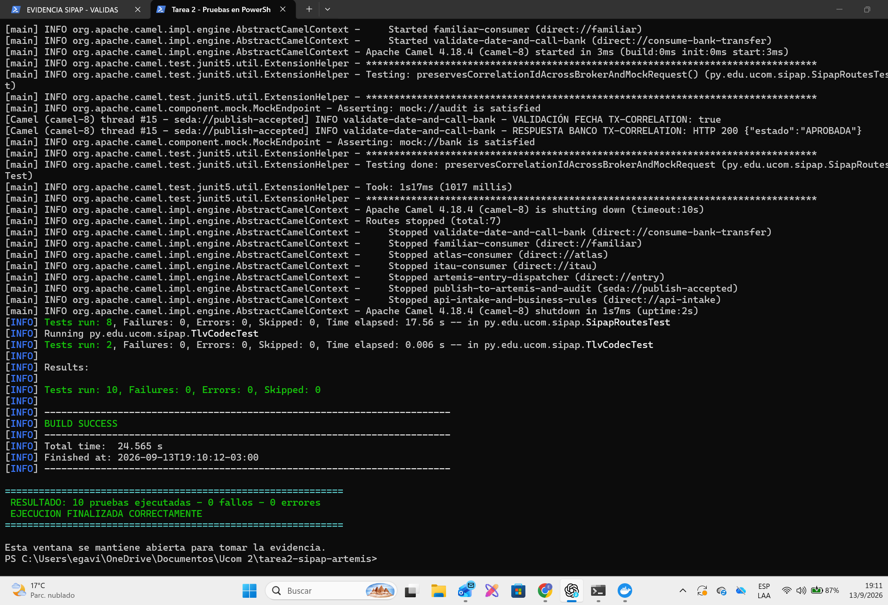

# Tarea 2 - Transferencias SIPAP con Camel y ActiveMQ Artemis

**Alumno:** Esteban Gavilan  
**Materia:** Integración de Sistemas

## ¿Qué hice en esta tarea?

Para esta tarea tomé el proyecto de la Tarea 1 y le agregué una API REST y colas
de ActiveMQ Artemis. La idea es recibir una transferencia con un QR, revisar sus
datos y mandarla a la cola del banco que corresponde.

Los bancos que usé para la prueba son:

- ITAU: `0015`
- ATLAS: `0007`
- FAMILIAR: `0020`

También usé WireMock para simular la respuesta de los bancos, porque no tenemos
un servicio real de cada banco para hacer la prueba.

## Programas necesarios

- Java 17
- Maven
- Docker Desktop

## Cómo ejecutar

Primero hay que abrir una terminal dentro de esta carpeta y levantar Artemis y
WireMock:

```powershell
docker compose up -d
```

Después se ejecutan las pruebas:

```powershell
mvn test
```

Para iniciar la aplicación:

```powershell
mvn exec:java
```

La aplicación queda funcionando en el puerto `8080`.

Para probar varios casos automáticamente hice este archivo:

```powershell
.\scripts\demo.ps1
```

Para mostrar las pruebas en una ventana de PowerShell y tomar la evidencia usé:

```powershell
.\scripts\evidencia-pruebas.ps1
```

## Petición para enviar una transferencia

Se usa esta dirección:

```text
POST http://localhost:8080/api/transferencias
Content-Type: application/json
```

Ejemplo del JSON:

```json
{
  "id_transaccion": "TX000001",
  "fecha_transaccion": "2026-08-13",
  "qr": "00020101021232400014py.gov.bcp.sip01040015021012345678905204573153036005405150005802PY5914TIENDA EJEMPLO6008ASUNCION6304A1B2",
  "monto": 10
}
```

La fecha debe ser la fecha del día en Paraguay. Cuando el QR es estático, el
monto se toma del campo `monto` del JSON. Cuando es dinámico, se usa el monto que
ya viene dentro del QR.

Si todo está bien responde:

```json
{
  "id_transaccion": "TX000001",
  "estado": "ACEPTADA_PARA_PROCESAMIENTO",
  "mensaje": "Transferencia enviada a la cola"
}
```

Para consultar cómo terminó el procesamiento:

```text
GET http://localhost:8080/api/resultados?id=TX000001
```

## Validaciones que agregué

- Si el monto es hasta G. 10.000.000 se acepta.
- Si supera G. 10.000.000 se rechaza antes de llegar a la cola.
- La fecha se compara con el día actual usando `America/Asuncion`.
- Si se repite el mismo `id_transaccion`, no se procesa otra vez.
- Si el QR está mal formado o el banco no existe, se rechaza.
- El consumidor llama al banco mock solamente si la fecha es correcta.

## Colas utilizadas

| Cola | Para qué la usé |
|---|---|
| `sipap.transferencias.entrada` | Recibe las transferencias aceptadas. |
| `sipap.auditoria` | Guarda una copia para auditoría. |
| `sipap.banco.itau` | Transferencias para ITAU. |
| `sipap.banco.atlas` | Transferencias para ATLAS. |
| `sipap.banco.familiar` | Transferencias para FAMILIAR. |

## Patrones utilizados

- **Message Channel:** usé canales `direct:` y `seda:` dentro de Camel y colas
  JMS para comunicarse con Artemis.
- **Message Translator:** el QR TLV se convierte al objeto `Transferencia`.
- **Content-Based Router:** se revisa el código del banco para elegir la cola.
- **Idempotent Receiver:** se guarda el ID para no procesarlo dos veces.
- **Correlation Identifier:** `id_transaccion` se mantiene desde la API hasta
  el banco mock y el resultado final.
- **Request-Reply:** el consumidor envía la transferencia a WireMock y espera su
  respuesta.
- **Multicast:** se manda una copia a la cola de entrada y otra a auditoría.
- **Message Store:** guardé los resultados en memoria para poder consultarlos.

El almacenamiento está en memoria porque es una práctica. Si se apaga la
aplicación se pierden los IDs y resultados guardados.

## Pruebas realizadas

Hice pruebas para los casos pedidos en la consigna: monto válido, monto mayor al
máximo, fecha correcta, fecha incorrecta, QR estático, error del banco mock,
mensaje duplicado, banco desconocido y conservación del ID.

Resultado: **10 pruebas ejecutadas sin fallos**.

## Evidencias

La evidencia muestra las pruebas ejecutadas directamente en PowerShell:



También dejé el resultado escrito en:

- `evidencias/resultado-pruebas-tarea2.txt`
- `evidencias/resultado-integracion-real.txt`

El diagrama está en `docs/diagrama-flujo.md`.

## Para detener todo

```powershell
docker compose down
```
