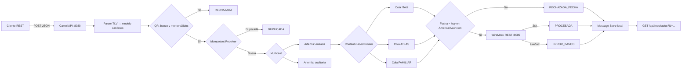

# Diagrama del flujo

```mermaid
flowchart LR
    C["Cliente REST"] -->|"POST JSON"| API["Camel API :8080"]
    API --> P["Parser TLV → modelo canónico"]
    P --> R{"QR, banco y monto válidos"}
    R -->|"No"| X["RECHAZADA"]
    R -->|"Sí"| I{"Idempotent Receiver"}
    I -->|"Duplicada"| D["DUPLICADA"]
    I -->|"Nueva"| M{"Multicast"}
    M --> Q0["Artemis: entrada"]
    M --> QA["Artemis: auditoría"]
    Q0 --> CBR{"Content-Based Router"}
    CBR --> Q1["Cola ITAU"]
    CBR --> Q2["Cola ATLAS"]
    CBR --> Q3["Cola FAMILIAR"]
    Q1 --> F{"Fecha = hoy en America/Asuncion"}
    Q2 --> F
    Q3 --> F
    F -->|"No"| RF["RECHAZADA_FECHA"]
    F -->|"Sí"| W["WireMock REST :8089"]
    W -->|"2xx"| OK["PROCESADA"]
    W -->|"4xx/5xx"| EB["ERROR_BANCO"]
    RF --> S["Message Store local"]
    OK --> S
    EB --> S
    S --> G["GET /api/resultados?id=..."]
```
